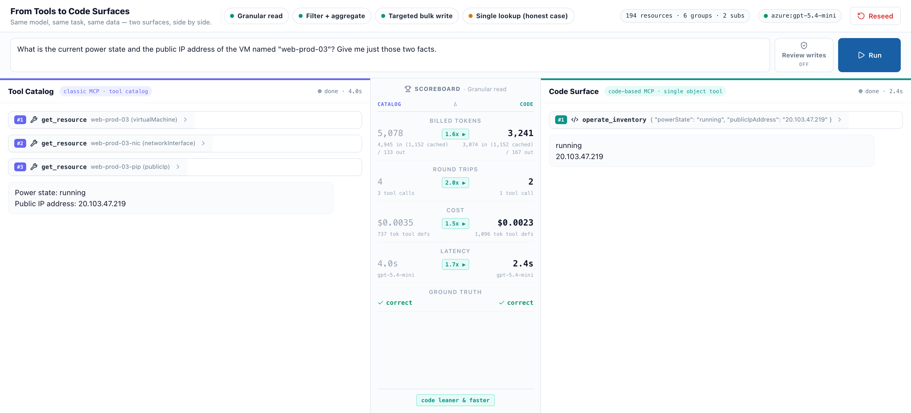

# Code Surface Benchmark

A live, side-by-side benchmark to illustrate the idea of using code surfaces instead of generic MCP tool cataloges.

Two agents use the same model against the same mock cloud inventory to do the
same tasks:

|       | Left panel — **Tool Catalog**                                                                                                         | Right panel — **Code Surface**                                   |
| -------| ---------------------------------------------------------------------------------------------------------------------------------------| ------------------------------------------------------------------|
| Shape | A fan of granular tools (`list_resources`, `get_resource`, `update_resource_tags`, `set_power_state`, …) — the conventional MCP shape | One object tool (`operate_inventory`) over a projected inventory |



Supports both generic openai endpoint via

```
OPENAI_API_KEY=...
OPENAI_MODEL=...
``` 

env vars as well as Azure OpenAI endpoints via:

```
AZURE_OPENAI_ENDPOINT=....
AZURE_OPENAI_API_KEY=...
AZURE_OPENAI_DEPLOYMENT=...
AZURE_OPENAI_API_VERSION=...
```


## Quick start

```bash
npm install
cp .env.example .env     # then set up your credentials in the .env file
npm run dev              # http://localhost:5173
```


## The tasks

The tasks are run against an LLM-generated mock Azure estate of ~200 resources: 2 subscriptions → 6 resource groups → multiple VMs, DBs, storage accounts etc.

1. **Granular read** — power state + public IP of `web-prod-03` (multi-hop: VM → NIC → public IP).
2. **Filter + aggregate** — monthly cost of running prod VMs by resource group, exact grand total;
   flag untagged.
3. **Targeted bulk write** — tag every untagged resource in `app-staging`; deallocate VMs
   idle > 30 days.
4. **Single lookup** — one trivial retreival, where a single tool call is generally more effecient"

## How it's built

A SvelteKit 2 / Svelte 5 / Tailwind 4 app.


## License

[MIT](LICENSE)
