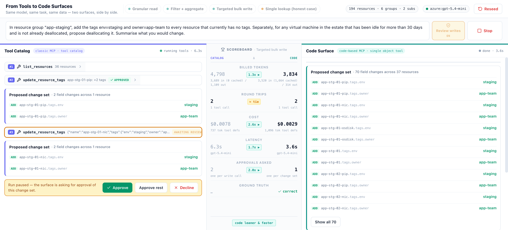

# Code Surface Benchmark

**Give an agent a data view it can program against. Watch how the work changes.**

This interactive demo puts two agents side by side: one uses a catalog of resource tools, the other writes JavaScript against a scoped cloud inventory. Give them the same task and follow the tool calls, generated code, answers and proposed changes as they happen.


*Screenshots show an earlier version of the demo. Displayed measurements have not been revalidated with the current harness.*

## The idea

An agent often needs to follow references, filter objects, calculate a total or update a collection. A code surface lets it express that work as a small program over a familiar object model.

The model sees the **schema**. The runtime holds the **data**. The program does the traversal and computation, then returns just the result the model needs. For writes, it edits a copy of the data; the runtime derives a proposed diff that you can review before applying.

That is the design opportunity this repo explores: **move data processing into code, keep answers compact, and make state changes inspectable.**

| | Tool Catalog | Code Surface |
|---|---|---|
| Interface | Six functions for listing, fetching and updating resources | One `operate_inventory` function over a projected object |
| Reads | Fetch resources and combine tool responses | Follow references, filter and aggregate in JavaScript |
| Writes | Update one resource per call | Propose a change set from edits to the object |

## Explore the demo

Pick a preset or write your own prompt against **194 mock cloud resources**:

- **Follow a reference chain:** find a VM's power state and public IP through its network interface.
- **Filter and aggregate:** total running production VM costs by group and find untagged VMs.
- **Make a bulk change:** tag staging resources and deallocate idle VMs, with optional review before applying.
- **Try a simple lookup:** count production resource groups and see where a narrow tool is a good fit.

Expand any tool call to inspect its inputs and outputs. Compare model turns, token usage, estimated cost and elapsed time in the scoreboard. Turn on **Review writes** to inspect the proposed changes before approving or declining them.



*Write review in the earlier UI. All operations use an in-memory mock estate.*

[Try it locally](#try-it) · [Read example programs](docs/solution-path-examples.md) · [Run benchmarks](#running-benchmarks) · [Comparison scope](#what-this-comparison-tells-you)

## Try it

Requires Node 20 or later. This is a local development demo; the [execution and isolation notes](#execution-and-isolation) cover its runtime limits.

```bash
npm ci
cp .env.example .env
# Configure a provider in .env, then:
npm run dev -- --host 127.0.0.1
```

Open the URL printed by Vite (normally http://localhost:5173). With no provider configured, the app uses a clearly labelled, deterministic **offline stub**. Stub token counts are estimates for exercising the UI, not benchmark measurements.

Set either:

```dotenv
OPENAI_API_KEY=...
OPENAI_MODEL=...
```

or:

```dotenv
AZURE_OPENAI_ENDPOINT=...
AZURE_OPENAI_API_KEY=...
AZURE_OPENAI_DEPLOYMENT=...
AZURE_OPENAI_API_VERSION=...
```

Azure configuration takes precedence when its endpoint and key are set. See [.env.example](.env.example) for custom OpenAI-compatible endpoints and pricing overrides. For Azure, ensure the configured model name and prices correspond to the actual deployment.

## Data and write contract

The fixed-seed builder creates **194 resources in two subscriptions and six resource groups**. Dates are anchored to the snapshot time, so idleness does not change with the wall clock.

Each run starts with a fresh estate. Both detailed catalog reads and the code surface expose the same allowlisted resource fields. Future internal fields are omitted until explicitly added to that list.

The supported writes are deliberately small:

- Resource tags: string keys and values; reserved prototype-related keys are rejected. Code may add, edit or remove tags; the catalog's tag tool merges additions/edits.
- VM `powerState`: `running`, `stopped`, or `deallocated`.
- Every other field, reference, resource identity and collection membership is read-only. Unsupported edits reject the proposal instead of being silently ignored.

The runtime derives a field diff and validates the whole proposed set, including the current values of the fields being written, before changing the mock estate. Review mode can decline the proposal. A decline is not counted as an applied write. The canonical seed is not changed by these supported operations.

This is a **state-update demo**, not an implementation of cloud provisioning. Assigning `powerState` changes a mock property. A real adapter would issue a provider operation, await its result and verify the new state. A reviewable diff is not an atomic transaction across services. Snapshot freshness, read dependencies, ordering, retries and partial failures remain real integration work. A restart or other action sequence cannot be represented by a net state diff alone.

See [solution paths](docs/solution-path-examples.md) for runnable examples.

## Running benchmarks

Start the configured server, then run:

```bash
BENCH_RUNS=5 npm run bench:live
# Optional: BENCH_BASE=http://localhost:5173
```

The harness refuses the offline stub. It runs surfaces sequentially to reduce shared-quota contention and retries provider rate limits. Each run uses a unique prompt-prefix marker to discourage cross-run cache reuse; **recorded cached-token counts establish actual cache use**. Within-run caching can still occur.

Results go to a new `docs/runs/<timestamp>/` directory (`BENCH_OUTPUT_DIR` can override the parent directory). The JSON includes task prompts, full run events, tool arguments and code, complete tool responses, proposed/applied diffs, the final state diff, per-turn usage, system prompts, tool descriptions and configured prices. Rate-limit attempts discarded from the reported matrix are retained separately. Git metadata describes the **harness checkout**; when using a remote server, record its revision separately. Keep the exact source/configuration used for any published run, especially if the checkout is dirty. No measured result set for the corrected implementation is committed yet.

What the columns mean:

- **Model turns:** calls to the model, including the final answer. Multiple tool calls may occur in one turn.
- **Tool calls:** dispatched function invocations, not cloud API calls or necessarily separate model round trips.
- **Tokens:** provider-reported input/output usage summed over all turns, including cached input. The schema-only number is a rough character-based estimate.
- **Estimated cost:** recorded usage priced at the configured input, cached-input and output rates. This is not an Azure invoice or total operating cost.
- **Elapsed:** model calls and local execution/streaming overhead, excluding human approval waits. It excludes live inventory acquisition and real backend operations, neither of which exists here.

## Validation

The UI reports **checks passed** using the task checks below.

For writes, checks compare every expected resource id, field, operation and before/after value against the successfully applied rows, reject extra writes, and compare the independently observed final estate diff. Read tasks must leave the estate unchanged.

For answers, the checker uses English text heuristics: the named VM's facts, the total and each group amount associated with its label to cent precision, an explicit untagged answer, and the group count plus every group name. Common Markdown tables and bullet lists are supported. Unusual valid phrasing can fail; contradictory prose or additional incorrect claims can still pass. Bulk-write summary prose is not semantically graded. Inspect the saved answers and traces before claiming full task correctness.

```bash
npm test
npm run check
npm run build
```

## What this comparison tells you

The model and agent loop are shared. Prompts, descriptions, data access, computation and write granularity differ, so this compares two interface packages. The four preset tasks are illustrative cases, not a representative workload sample. Functions are dispatched in-process using an OpenAI-compatible tool-calling API; this repo does not implement or benchmark MCP transport.

Cloud inventory is a convenient illustration, not a claim that JavaScript is the best Azure query interface. [Azure Resource Graph/KQL](https://learn.microsoft.com/en-us/azure/governance/resource-graph/concepts/query-language) already supports filtering, joins, projection and aggregation. SQL, domain query tools, calculators, batch writes, and [code that calls existing MCP tools](https://www.anthropic.com/engineering/code-execution-with-mcp) are plausible alternatives that this comparison does **not** measure.

The aggregate's full set of VM summaries is available through one filtered catalog call; any further surveying is a model choice. The code side has deterministic arithmetic and a date helper that the catalog lacks. These differences are part of the compared packages, not isolated experimental controls. Examples in the code-tool description use unrelated targets rather than the preset task's exact solutions.

A useful fit for a projected-object interface is a bounded, sufficiently fresh data view with inexpensive local transformations and well-defined state updates. Cross-linked objects alone do not establish that fit. The fixture does not measure snapshot acquisition, large-dataset paging, concurrent changes, security robustness, or broad model/task generalization. A few repeated runs do not establish production reliability or a stable cost distribution.

## Relationship to the submitted article

The submitted article and existing screenshots describe an earlier revision. This checkout corrects issues found during review: truncated catalog results, partial correctness checks, task-specific code examples, unsupported mutations being accepted or ignored, and incomplete run evidence.

**Historical token/cost ratios and “exact correctness” claims have not been revalidated with this corrected harness.** New runs are new measurements and must be reported as such. The execution and isolation notes below also apply to the earlier implementation.

## Execution and isolation

**The executor uses `node:vm` for convenience. It is not a security sandbox.** Code can escape the context and reach the host process, including its environment and credentials. A timeout and an omitted global do not prevent that. Run this as a local development experiment with trusted inputs; do not expose the server to untrusted users. See [Node's explicit warning](https://nodejs.org/api/vm.html#vm-executing-javascript).

The projection and mutation validators demonstrate a data contract. They catch unsupported edits by ordinary scripts; they do not contain hostile code in the same process. This repo does not claim production isolation or resistance to prompt injection.

A production implementation needs an execution boundary appropriate to its threat model: for example, a capability-restricted WebAssembly runtime or an isolated process/container/microVM with enforced filesystem, network, memory and CPU limits. Keep backend credentials and the authorized commit path outside that runtime. Validate outputs and proposed changes independently, and scope reads and writes to the caller. These are additional engineering requirements, not properties supplied by this demo's VM. [Wasmtime's capability model](https://docs.wasmtime.dev/security.html) and [Cloudflare Dynamic Workers](https://developers.cloudflare.com/dynamic-workers/) are examples of execution systems to evaluate, not drop-in replacements configured in this repository.

## Implementation and license

SvelteKit 2 / Svelte 5 / Tailwind 4, TypeScript, and a small provider/agent loop. [MIT](LICENSE).
